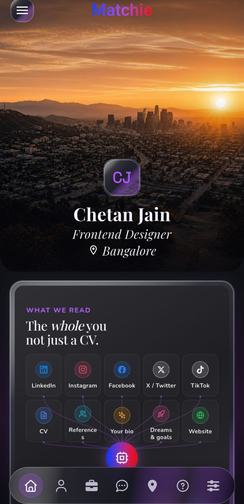
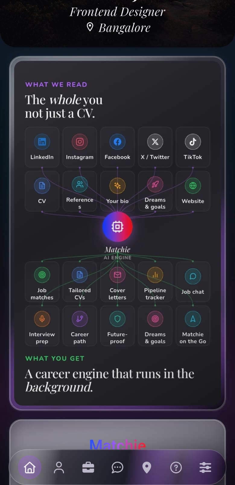
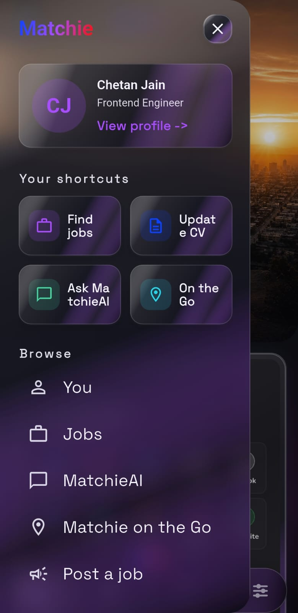
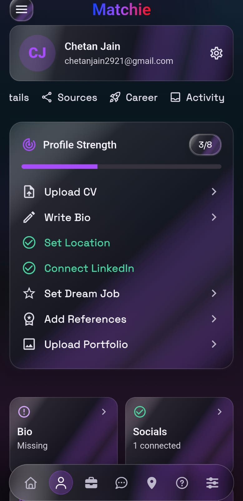
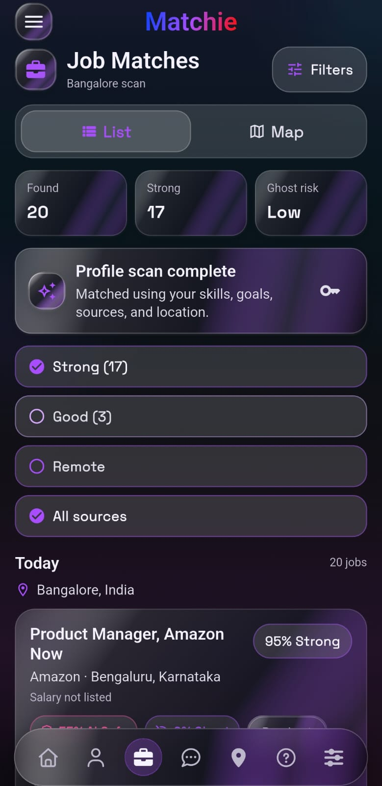
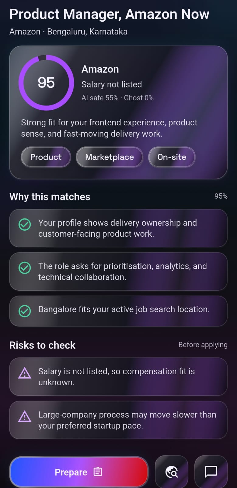
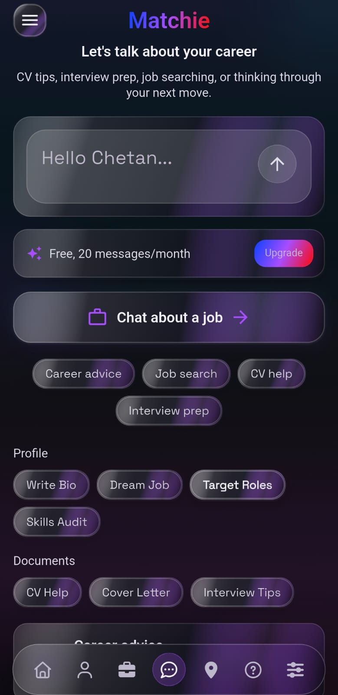
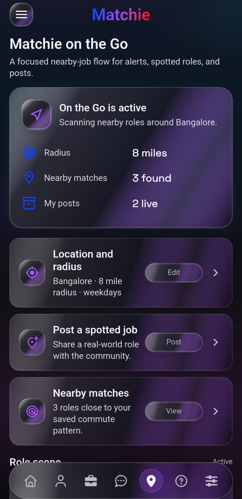
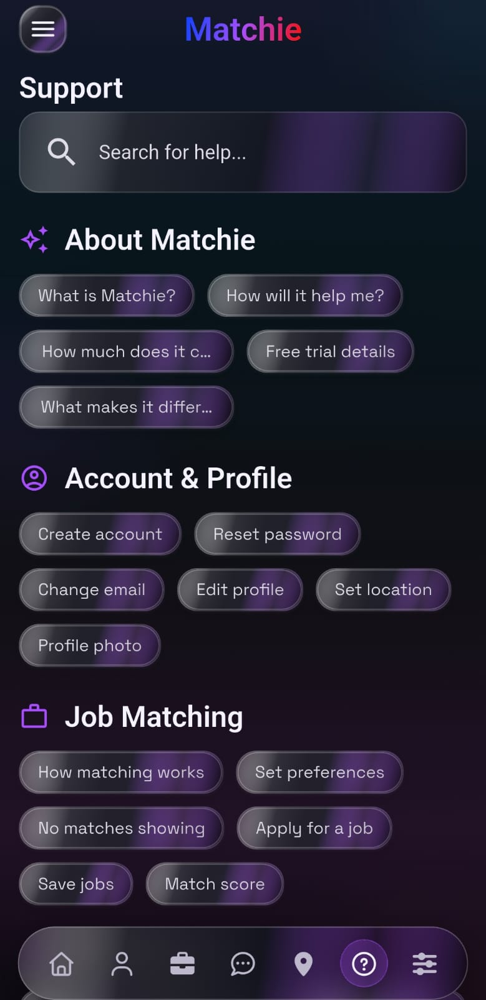
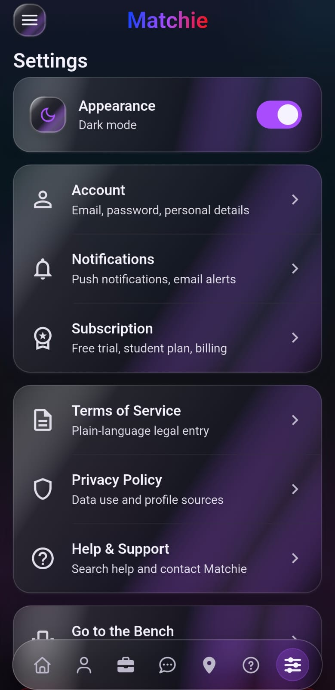

# Matchie

Matchie is a Flutter prototype for an AI career app. It brings profile setup, job matching, CV help, career chat, nearby role discovery, support, and settings into one dark glassmorphism interface.

The app is built as a mobile-first prototype with a floating navigation bar and a shared visual system across screens. Most flows use local prototype data so you can inspect the product experience without connecting a backend.

## Screenshots

<p>
  
  
  
</p>

<p>
  
  
  
</p>

<p>
  
  
  
</p>

<p>
  
</p>

## What Is In The Prototype

- A home screen with a city hero, profile summary, Matchie AI engine artwork, and app download footer.
- Profile setup screens for personal details, sources, bio, portfolio, references, career goals, and profile strength.
- Job matching screens with list and map modes, fit scores, filters, job detail, risks, and preparation actions.
- MatchieAI screens for career questions, CV help, interview prep, and job search prompts.
- Matchie on the Go screens for nearby role scanning, location radius, spotted jobs, and role scope.
- Support and settings screens using the same dark glassmorphism style.
- A sidebar menu with shortcuts and primary navigation.

## Tech Stack

- Flutter
- Dart
- Material widgets
- `google_fonts`
- `font_awesome_flutter`

## Project Structure

```text
lib/
  main.dart
  prototype_shell.dart
  prototype_screens.dart
  prototype_theme.dart
assets/images/
  matchie_ai_engine.jpeg
  matchie_home_art.jpeg
  matchie_city_hero.png
docs/screenshots/
  *.jpeg
test/
  widget_test.dart
```

## Run Locally

Install dependencies:

```sh
flutter pub get
```

Run the app:

```sh
flutter run
```

Analyze the project:

```sh
flutter analyze
```

Run tests:

```sh
flutter test
```

Build an Android APK:

```sh
flutter build apk
```

The release APK is written to:

```text
build/app/outputs/flutter-apk/app-release.apk
```
